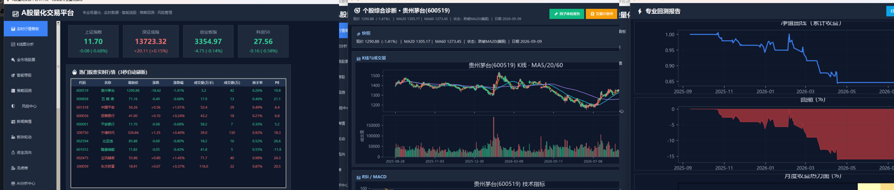

# A股量化研究工作站 · A-Share Quant Research Workbench

> 从“研究一只股票”到“生成交易计划书”，一个软件闭环。
> From "researching one stock" to "a trade plan", in one closed loop.

Live site: https://lilong123-93790997.github.io/astock-quant-site/ · 中文首页 [index.html](index.html) · English [index_en.html](index_en.html) · 功能与版本 [features.html](features.html)

## 功能特性 Features
- 多市场实时行情（A股/港股/美股）：默认仅实时；收盘显示最近一笔真实价并标注；**绝不拿模拟数据冒充实时**。
- 全市场名单：全A股 + 港股 + 美股（断网用内置名单兜底，只补名称不带假价）。
- 交互式K线 + 双击“个股综合诊断”（K线+RSI/MACD+158因子快照）。
- 研究实验室：Alpha101/Alpha158 因子、IC/RankIC 体检、遗传规划自动挖因子。
- 专业回测：多策略模板、参数寻优、Walk-Forward 样本外验证、手续费/滑点/止损。
- 自然语言生成策略：一句话描述 → 自动变可回测策略（可选大模型结构化）。
- 策略库：保存/载入/回测/生成交易计划书。
- 组合诊断驾驶舱：多基准归因、RBSA 风格暴露、MCTR/CVaR 风险分解、持仓效率象限。
- 职业交易计划书：市场状态 → 技术快照 → 头寸计算 → 实盘合规预检 → 情景计划。
- 盘前作战简报 / 每日复盘：自动生成并推送（Bark / Server酱 / 企业微信）。
- 程序内可视化弹窗：研究结果直接弹窗看图看表，无需去文件夹找文件。

## 体验 Trial
- 平台：Windows 10/11（64位），单文件绿色运行。
- 试用：7 天全功能免费试用；正式授权码请联系作者。

## 免责声明 Disclaimer
本软件为量化研究/教学工具，不构成任何投资建议；历史回测不代表未来表现；股市有风险，入市需谨慎。
This software is a research/education tool. It does NOT provide investment advice. Past backtests do not guarantee future results.
